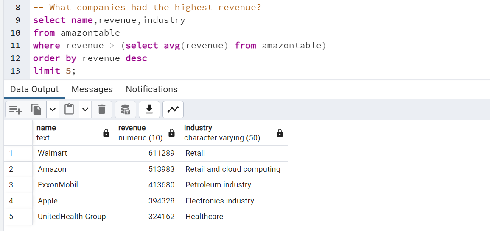

# 
 Companies-in-the-USA

# 
 Introduction
This list comprises the largest companies currently in the United States by revenue as of 2023, according to the Fortune 500 tally of companies and Forbes.
The Fortune 500 list of companies includes only publicly traded companies, also including tax inversion companies. There are also corporations having foundation in the United States, such as corporate headquarters, operational headquarters and independent subsidiaries. The list excludes large privately held companies such as Cargill and Koch Industries whose financial data is not necessarily available to the public. However, this list does include several government-sponsored enterprises that were created by acts of Congress and later became publicly traded.

# 
 Queries and Output

# Question 1

---

# Question 2

---

# Question 3

---

# Question 4

---

# Question 5
Question 5a           | Question 5b
:--------------------:|:----------------:
   | 
---

# Question 6

---
# 
 Insights
1. Financials have the highest number of companies but Retail racks in the highest revenues.
   
3. Walmart and Amazon are very close in terms of revenue but Walmart still takes the lead. ExxonMobile, in the petroleum industry takes the lead after Amazon and also after Exxon is Apple(An electronics industry).
   
5. In terms of revenue numbers, Best Buy is far behind Walmart's number. The only company remotely close to Walmart's number is Amazon.
   
7. Despite Walmart being in the lead, it still has a revenue growth of 7%, where as TD Synnex has the highest revenue growth of 97%, an infotech company, followed by WorldFuelServices. Even tho, their respective revenues are 62,344 and 59,043 . With this consistency in their revenue growth they are on their way to succeed.
   
9. Its no suprise that Walmart and Amazon has the highest staffing. With walmart having 2.1million employees and amazon having 1.5million employees.They have all hands on deck that ensures the sucessful run of these companies. PBF energy has the lowest staffing with 3,616 employees.
    
11. Majority of the companies headquarters are located in New York.
